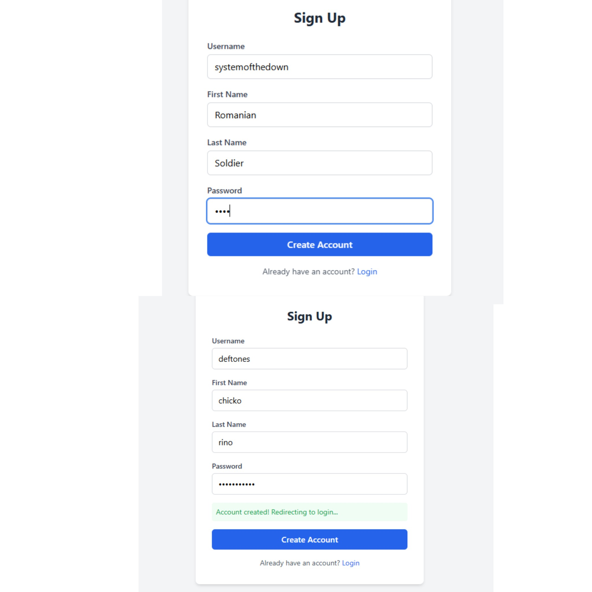
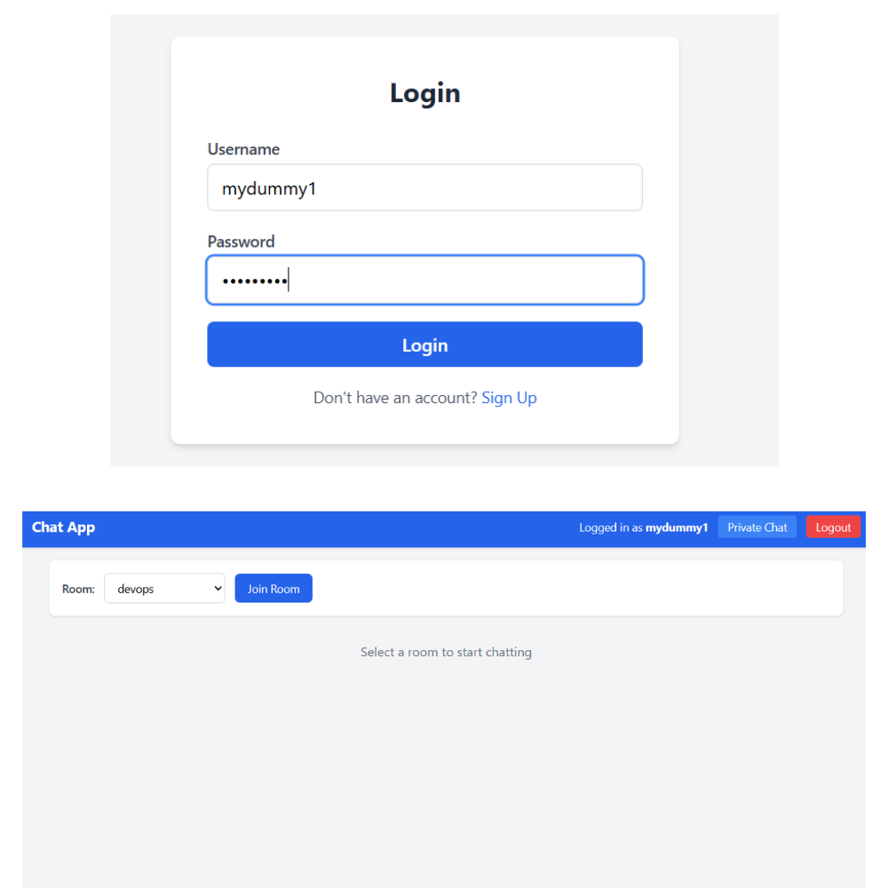
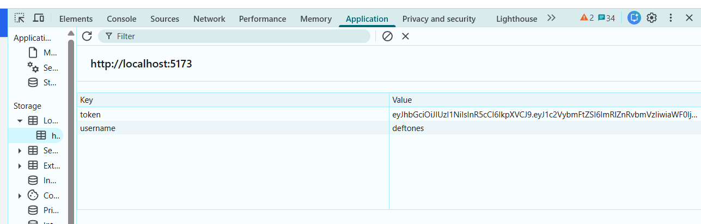
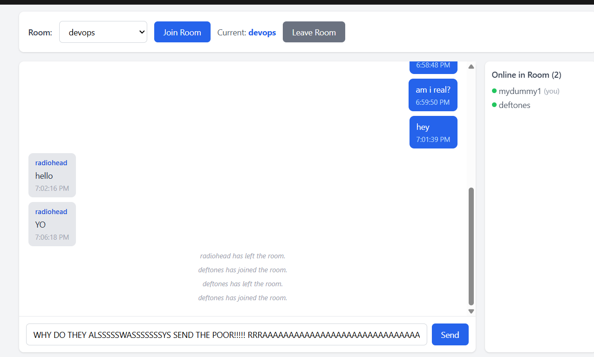
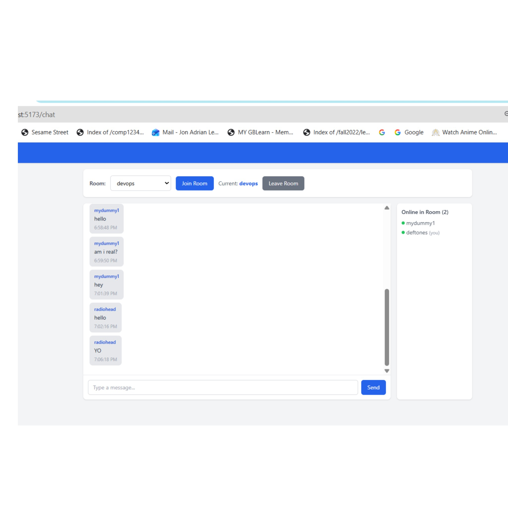
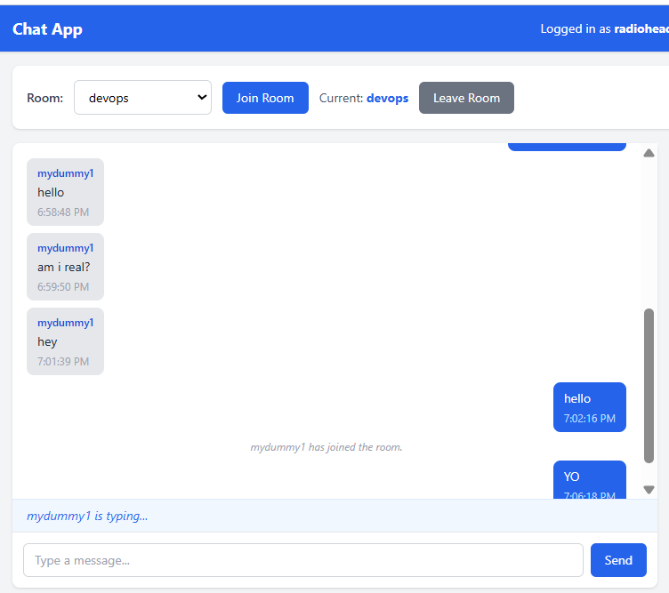
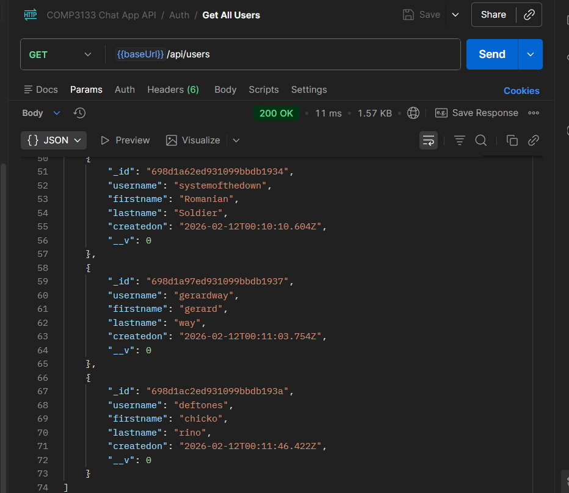
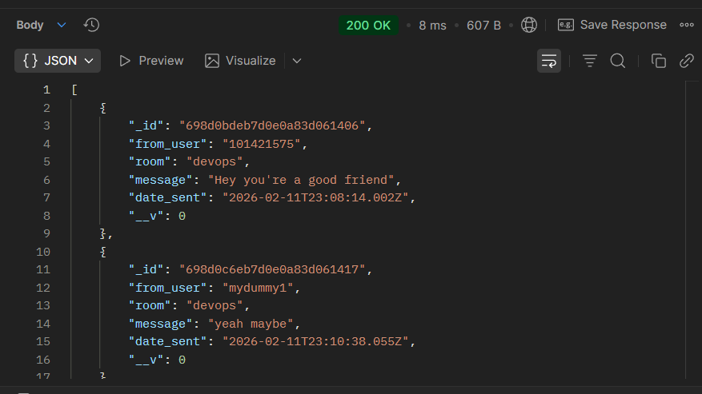
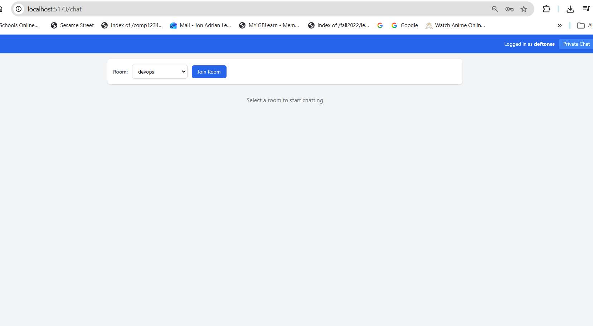
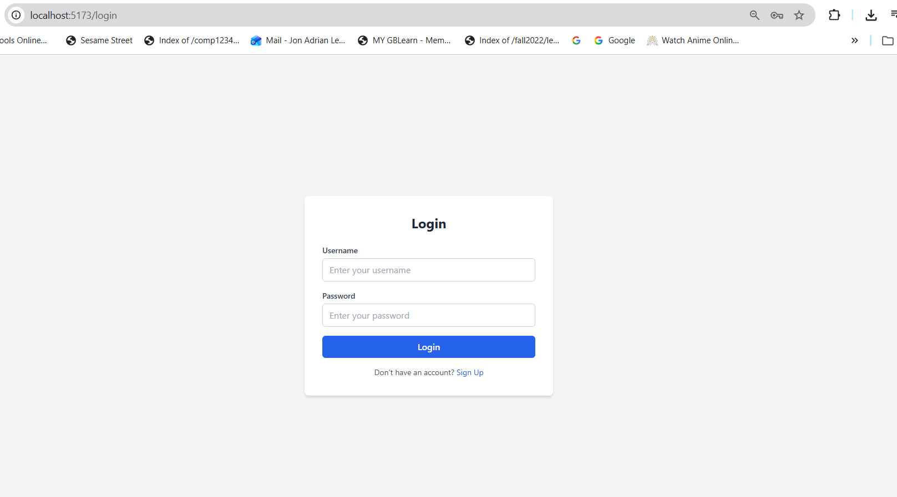

# COMP3133 Lab Test 1 - Real-time Chat App

**Student:** Jon Adrian Lee  
**Student ID:** 101421575

## Overview
A real-time chat application I built using Node.js, Express, Socket.io and MongoDB on the backend, with React and Tailwind CSS on the frontend. It supports group chat rooms, private messaging between users, typing indicators, and basic user authentication.

## Features
- [x] Signup page - creates account with unique username, stores in MongoDB
- [x] Login page - authenticates with bcrypt hashed passwords
- [x] JWT token + localStorage session
- [x] 5 predefined chat rooms (devops, cloud computing, covid19, sports, nodeJS)
- [x] Join and leave room
- [x] Real-time group chat with Socket.io
- [x] Private messaging (DMs) between two users
- [x] All messages saved to MongoDB (both group and private)
- [x] Typing indicator for rooms and private chat
- [x] Online users list per room
- [x] Logout clears localStorage and redirects to login

## Tech Stack
- **Backend:** Node.js, Express, Socket.io, Mongoose
- **Frontend:** React (Vite), Tailwind CSS, Socket.io-client
- **Database:** MongoDB

## How to Run

### Prerequisites
- Node.js (v18 or higher)
- MongoDB running locally on port 27017 (or update the .env)

### Server Setup
```bash
cd server
cp .env.example .env
npm install
npm run dev
```
Server runs on http://localhost:3000

### Client Setup
```bash
cd client
npm install
npm run dev
```
Client runs on http://localhost:5173

## API Endpoints

| Method | Endpoint | Description |
|--------|----------|-------------|
| POST | /api/signup | Create new user |
| POST | /api/login | Login and get JWT token |
| GET | /api/messages/group?room=ROOM | Get group messages for a room |
| GET | /api/messages/private?me=USER&with=OTHER | Get private messages between two users |

## Screenshots

### Signup Working


### Login Working


### localStorage Proof


### Join Room


### Chat in Two Browsers


### Typing Indicator


### MongoDB Users Stored


### MongoDB Messages Stored


### Leave Room


### Logout

